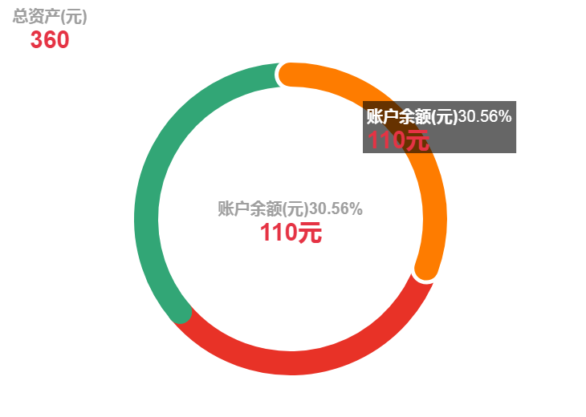
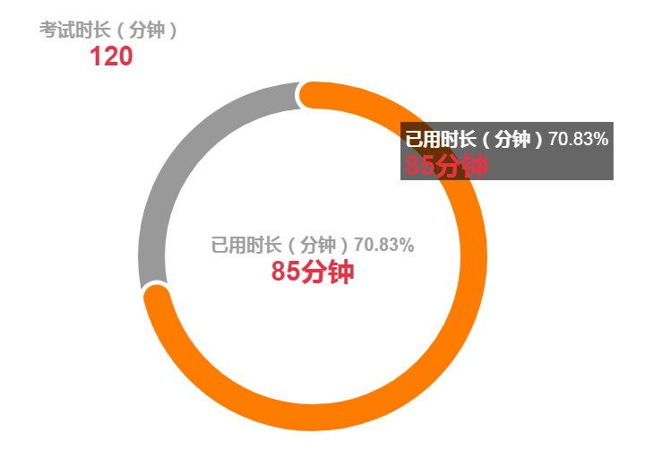

## 声明

> 市场上虽然有各种基于canvas的图表工具，比如echarts.js ,chart.js。他们功能都很强大，性能也非常优秀。但是饼形图或环形图中并没有以圆角为交界的图表。




> **本插件使用canvas可以帮助你快速创建一个以圆角交界的环形图**
## 兼容性
> 适用于所有主流浏览器及移动端的浏览器。**IE8及以下不支持**
## 安装
>> npm install donut-chart
## demo
>> http://www.yangchaojie.top/plugin/donut-chart
## 用法
>> 首先需要一个canvas做载体
```html
    <canvas id="myCanvas" width="750" height="600"></canvas>
```
>> 然后创建环形图对象
```javascript
    var cir = new DonutChart('myCanvas', option)
```
>> 最后初始化并且可以指定回调函数
```javascript
    cir.init(function (result) {
        // result 选中的选区的相关信息
    })
```
## 参数
>> option 示例 (默认值)
```javascript
    var option = {
        type: 'pie', // pie 环形图|| gauge 计量图
        title: {
            show: true,
            text: '总资产(元)',
            textStyle: {
                fontSize: "20px",
                lineHeight: "30px",
                color: '#9f9f9f'
            },
            subtext: '360',
            subtextStyle: {
                fontSize: "30px",
                lineHeight: "35px",
                color: '#e53344'
            },
            x: '50%', // title 位置
            y: "50%",
        },
        tooltip: {
            show: true,
            fontStyle: "normal",    // 	规定字体样式 normal || italic || oblique
            fontVariant: "normal",  // 规定字体变体 normal || small-caps
            fontWeight: 'normal',   // 规定字体的粗细 normal || bold || bolder || lighter || 100 || 200 || 300 || 400 || 500 || 600 || 700 || 800 || 900
            fontSize: "20px",   // 规定字号，以像素计
            lineHeight: "30px", // 规定行高，以像素计
            fontFamily: 'Arial',// 规定字体系列
            color: 'white',     // 字体颜色
            backgroundColor: '#00000099', // tip 背景
            formatter: function (param) {   // 类似echarts 富文本编辑
                var str = "{a|" + param.name + "}" + "{c|" + param.percent + "}" + '\n' + "{b|" + param.value +
                    "元}"
                return str
            },
            rich: {
                a: {
                    fontStyle: "normal",
                    fontVariant: "normal",
                    fontWeight: 'bold',
                    fontSize: "20px",
                    lineHeight: "30px",
                    fontFamily: 'Arial',
                    color: 'white',
                },
                c: {
                    fontStyle: "normal",
                    fontVariant: "normal",
                    fontWeight: 'normal',
                    fontSize: "20px",
                    lineHeight: "30px",
                    fontFamily: 'Arial',
                    color: 'white',
                },
                b: {
                    fontStyle: "normal",
                    fontVariant: "normal",
                    fontWeight: 'bold',
                    fontSize: "30px",
                    lineHeight: "35px",
                    fontFamily: 'Arial',
                    color: '#e53344',
                }
            }
        },
        x: "50%",   // 图标位置
        y: "50%",
        radius: "30%",  // 半径
        lineWidth: "5%", // 圆环宽度
        // {{if type === gauge 计量图}}

        // max: 120, // 映射总值
        // data: [{
        //     name: "已用时长（分钟）",
        //     value: 85, // 映射计量值
        // }],

        // {{else if type === pie 环形图}}

        // data: [{
        //     name: "账户余额(元)",
        //     value: 110,
        // }, {
        //     name: "散标待回(元)",
        //     value: 120,
        // }, {
        //     name: "在途资金(元)",
        //     value: 130,
        // }],

        // {{/if}}
        label: {
            show: true,
            fontStyle: "normal",
            fontVariant: "normal",
            fontWeight: 'bold',
            fontSize: "20px",
            lineHeight: "30px",
            fontFamily: 'Arial',
            color: '#9f9f9f',
            formatter: function (param) {
                var str = "{a|" + param.name + "}" + "{c|" + param.percent + "}" + '\n' + "{b|" + param.value +
                    "元}"
                return str
            },
            rich: {
                a: {
                    fontStyle: "normal",
                    fontVariant: "normal",
                    fontWeight: 'bold',
                    fontSize: "20px",
                    lineHeight: "30px",
                    fontFamily: 'Arial',

                },
                b: {
                    fontStyle: "normal",
                    fontVariant: "normal",
                    fontWeight: 'bold',
                    fontSize: "30px",
                    lineHeight: "35px",
                    fontFamily: 'Arial',
                    color: '#e53344',
                },
                c: {
                    fontStyle: "normal",
                    fontVariant: "normal",
                    fontWeight: 'bold',
                    fontSize: "20px",
                    lineHeight: "30px",
                    fontFamily: 'Arial',

                }
            }
        },
        capType: "round", // 圆角 || butt 平角
        selectedStyle: {  // 选中时的样式
            color: "white", // 包边颜色
            borderWidth: 10 // 包边宽度
        },
        color: ["#fe7c00", "#e83227", "#32a676"],
        labelCoverTitle: true, // label 是否覆盖标题
        backgroundArc: '#999' // 空圆环的颜色
    }
```